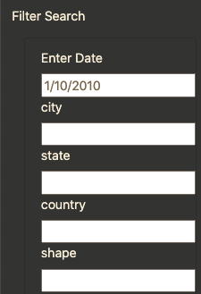

# UFO

## Overview of Project: 
The purpose of this in-depth [analysis](./index.html) of UFO sightings is to demonstrate the use of HTML, CSS, and Javascript functions allowing users to filter for multiple criteria at the same time. In addition to the date the user may add table filters for the city, state, country, and shape.

## Results:
At the main page of the app the user may query the datatable by typing in one or more of the filter fields up the users desired sepcificity.

Upon input the table automatically updates and returns a new table of data only where the filter criteria is matched. To clear filters and start over the user can click the "UFO SIGHTINGS" link in the navbar at the top of the page.

## Summary:
The apps ability to filter data is functional, but one way that the app could be more useful is with the addition of an export feature where a user can 
transform filtered data into another dataset.
